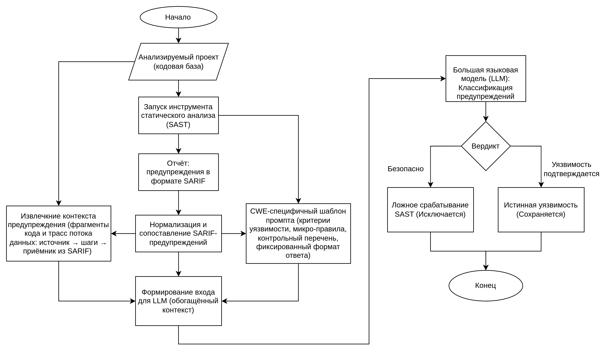
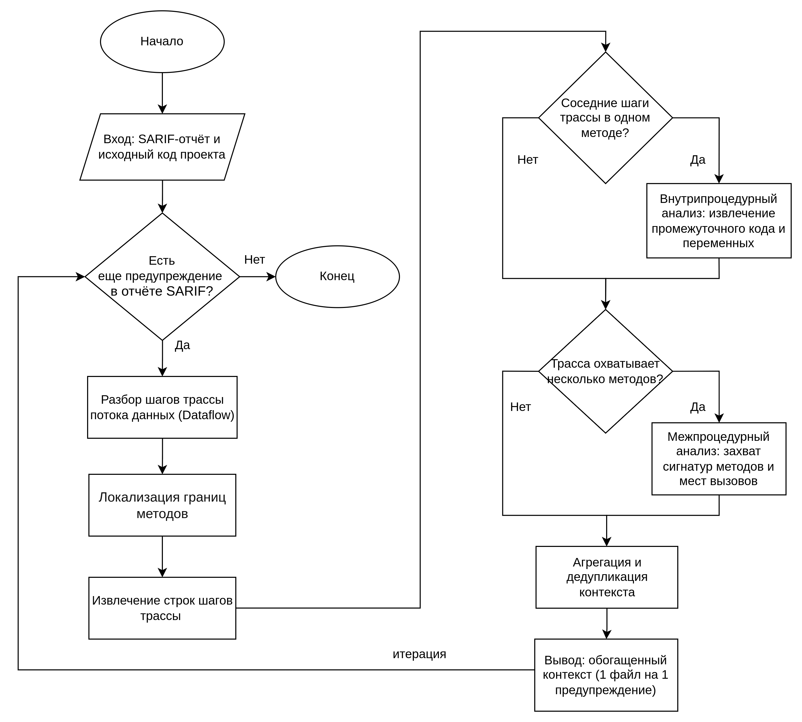
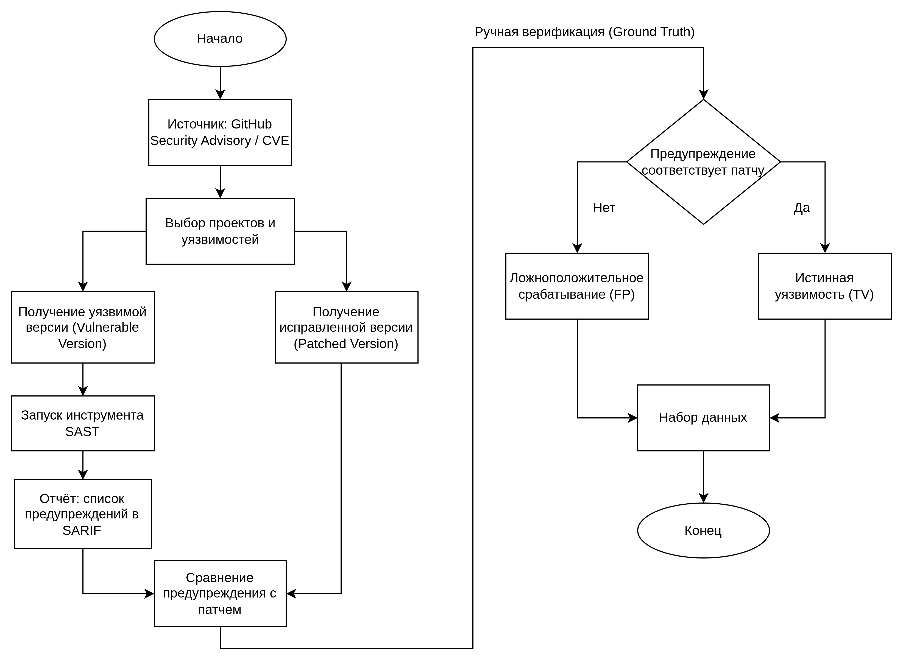
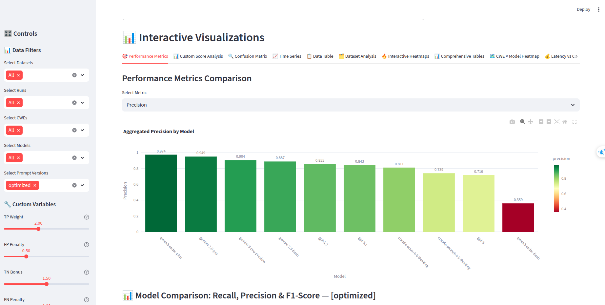
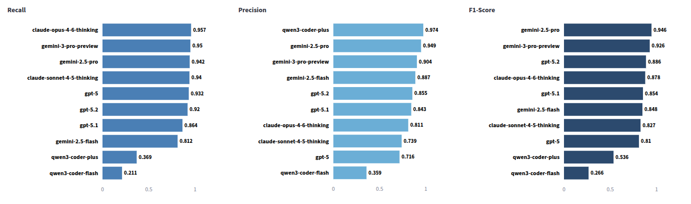
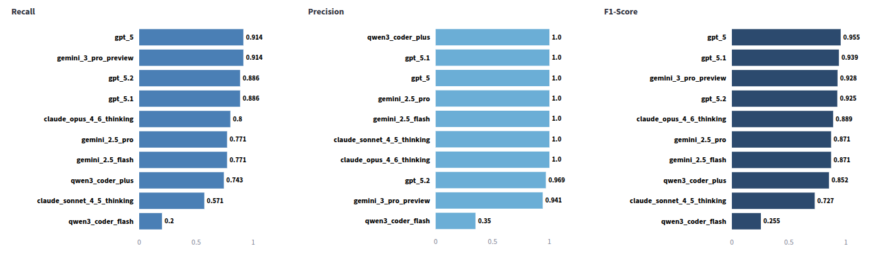
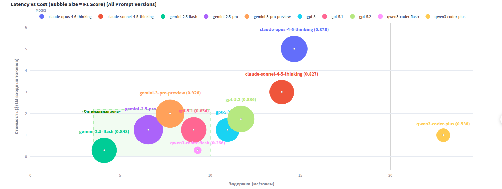
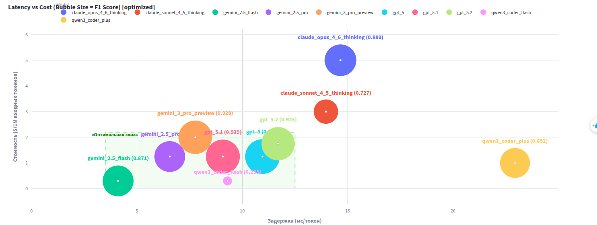

# Master Thesis: Improving Precision in Static Analysis with LLMs

[](https://www.python.org/downloads/)
[](https://github.com/quangtuanitmo18/llm-sast-fp-filter)
[](https://owasp.org/www-project-benchmark/)

A research framework for evaluating Large Language Models (LLMs) in false positive reduction across multiple vulnerability datasets and CWE categories.

## Overview

This framework combines static analysis with LLMs for security vulnerability detection and false positive reduction. The framework evaluates the effectiveness of various LLMs in reducing false positives from static analysis tools.

## Methodology

### Comparison of Existing Approaches

| Approach | Context Extraction | Prompting Strategy | Key Quantitative Results | Key Features & Limitations |
|----------|--------------------|--------------------|--------------------------|----------------------------|
| **[1] LLM4SA** | **Coarse-grained**: Passes the entire function body to the LLM. | **Universal**: One common template for all vulnerabilities. | On a mixed dataset (Juliet + 3 embedded OS + 11 real C/C++ projects): Precision = 0.811, Recall = 0.946, F1 = 0.874 | Simple integration, but high noise level and weak adaptation to different CWE categories. |
| **[2] LLM4FPM** | **Code slices**: More precise context, but requires graph infrastructure and additional computations. | **CWE-aware**: Takes into account the specific CWE type. | On test dataset (Juliet): F1 = 0.99<br>On real dataset (D2A): Relabeling accuracy = 0.860 | More precise context, but complex infrastructure and additional computational costs. |
| **[3] Towards Effective Complementary Security Analysis using LLMs** | SAST warning and related code. | **Enhanced reasoning strategies**. | On test dataset (OWASP Benchmark): Filtered false positives rate = 0.625 (ensemble = 0.789)<br>On real dataset: 0.339 (ensemble = 0.385) | Strong focus on model reasoning, but lacks an explicit structured source-to-sink trace. |
| **Proposed Method** | **Full trace (Dataflow)**: Custom algorithm extracts the exact path from source to sink. | **CWE-specific criteria** and fixed response format. | On test dataset (OWASP Benchmark): F1 = 0.946<br>On real dataset: F1 = 0.955 | Improves reproducibility, does not require heavy external graph infrastructure, and is oriented towards practical integration in DevSecOps. |

### Proposed Method Architecture

<div align="center">
  
</div>

**Note:**
- **Task:** Detecting SAST False Positives
- **SARIF:** Static Analysis Results Interchange Format
- **CWE:** Common Weakness Enumeration
- **CVE:** Common Vulnerabilities and Exposures
- **LLM:** Large Language Model
- **TP/FP:** True Positive / False Positive

### Code Context Extraction Algorithm

<div align="center">
  
</div>

Passing entire files to an LLM is inefficient and introduces significant "information noise". To solve this, our algorithm dynamically extracts only the verified vulnerability path (from source to sink) based on the SARIF report. The extraction handles two key scenarios:

- **Intra-procedural Analysis:** When data flow steps occur within the same method, the algorithm extracts the relevant intermediate code and operations on variables between those steps.
- **Inter-procedural Analysis:** When the vulnerability spans across multiple functions, the system captures **method signatures** (parameters, return types) and **exact call sites** to restore the full logical chain of how tainted data propagates across boundaries.

This ensures the LLM receives a clean, aggregated, and deduplicated context. It saves tokens, prevents model hallucination, and significantly improves detection accuracy (F1-score).

### CWE-Specific Prompt Architecture

To minimize hallucinations and turn the LLM into a strict security auditor, we utilize a highly structured, 5-block prompt template:

| No. | Prompt Block | Purpose | Content | Result |
|---|---|---|---|---|
| **1** | **Role Setup** | Unification of model behavior | Role "InfoSec Analyst"; work by CWE; prohibition of extra text | Standardized response |
| **2** | **Context Restriction** | Reproducibility and hallucination prevention | Use only provided code and SARIF data trace; do not assume unseen code | Conclusion strictly based on observable facts |
| **3** | **CWE-Specific Micro-Rubric** | Accounting for specific vulnerability characteristics | Conditions for specific CWE; danger signs; safe patterns | Correct and context-dependent assessment |
| **4** | **Checklist** | Reducing subjectivity of decisions | Analysis logic: from data source to sink, considering protection mechanisms and exploitability | Stable and logically sound decision |
| **5** | **JSON Output Format** | Integrating result into pipeline | Brief JSON: FP/TP? protection? attack? confidence level | Machine-readable format for automation |

### Key Features
- **Multi-Model Support**: Integration with state-of-the-art LLMs including GPT-4o, Gemini 2.5 Pro, and DeepSeek R1
- **Dual Dataset Support**: Evaluation on both real-world vulnerabilities (OpenVuln) and standardized benchmark (OWASP)
- **Comprehensive CWE Coverage**: Analysis across 10 major vulnerability categories
- **Interactive Dashboard**: Streamlit-based visualization and analysis tools
- **Parallel Processing**: Efficient batch processing with configurable threading

## Datasets & Setup

### Data Collection Methodology

<div align="center">
  
</div>

To rigorously evaluate the LLMs, we utilize two distinct datasets:

1. **Synthetic Benchmark (OWASP):** 1,456 warnings across 10 CWE categories. Generated via Semgrep's inter-procedural taint analysis.
2. **Real-World Dataset (OpenVuln):** 58 warnings from 7 open-source projects, allowing us to evaluate models against complex business logic and "domain shift" challenges.

#### Real-World Dataset Construction & Ground Truth

To ensure absolute Ground Truth accuracy for the OpenVuln dataset, we avoided automated line-matching (which is prone to errors due to line shifting and refactoring). Instead, we employed a strict **manual verification** process:
1. **Extract:** Retrieve the vulnerable code and the official developer patch via CVE / GitHub Security Advisory.
2. **Scan:** Run SAST (Semgrep) to generate a structured SARIF report containing the full data flow traces.
3. **Verify:** Compare the SARIF data flow against the official patch. If the trace intersects with the patched lines, it is marked as a **True Positive (TP)**. If it triggers on unpatched lines, it is marked as a **False Positive (FP)**.

### Supported Datasets

#### OpenVuln Dataset
Real-world vulnerability analysis using actual CVE data from 7 open-source projects:

| Project | CVE | CWE | Description |
|---------|-----|-----|-------------|
| Apache JSPWiki | CVE-2022-46907 | CWE-22 | Path Traversal |
| HAPI FHIR | CVE-2023-28465 | CWE-79 | Cross-site Scripting |
| DependencyCheck | CVE-2018-12036 | CWE-78 | OS Command Injection |
| Keycloak | CVE-2022-4361 | CWE-89 | SQL Injection |
| Spark | CVE-2016-9177 | CWE-22 | Path Traversal |
| Undertow | CVE-2014-7816 | CWE-22 | Path Traversal |
| zt-zip | CVE-2018-1002201 | CWE-22 | Path Traversal |

#### OWASP Benchmark
Standardized evaluation using OWASP Java Benchmark with 10 CWE categories:

| CWE-ID | Description | Test Cases |
|--------|-------------|------------|
| CWE-022 | Path Traversal | 271 |
| CWE-078 | OS Command Injection | 251 |
| CWE-079 | Cross-site Scripting (XSS) | 274 |
| CWE-089 | SQL Injection | 201 |
| CWE-090 | LDAP Injection | 59 |
| CWE-327 | Broken Cryptographic Algorithm | 44 |
| CWE-330 | Insufficient Random Values | 4 |
| CWE-501 | Trust Boundary Violation | 75 |
| CWE-614 | Insecure Cookie | 4 |
| CWE-643 | XPath Injection | 6 |

### Experimental Setup (LLM Configuration)

We evaluated 10 state-of-the-art Large Language Models from leading developers (OpenAI, Anthropic, Google, and Alibaba) to assess their capability in security reasoning. To guarantee scientific reproducibility, all API calls were executed with **Temperature = 0** for deterministic output.

| Model | Architecture | Reasoning Level | Key Strengths / Characteristics |
|-------|-------------|-----------------|---------------------------------|
| **GPT-5** | Mixture of Experts (MoE) | High | Exceptional multi-step deductive reasoning; achieves ideal F1-score balance. |
| **GPT-5.1 / 5.2** | MoE | High | Strong balance of cost, latency, and complex context retention. |
| **Claude 4.6 Opus** | Dense | High | Highly stable logic via dense architecture, but expensive and slower. |
| **Claude 3.5 Sonnet (Thinking)** | Dense | Very High | Deep reasoning (Chain-of-Thought), but overly conservative (low recall). |
| **Gemini 3 Pro Preview** | MoE | High | Excellent on benchmarks, optimal balance in speed and quality. |
| **Gemini 2.5 Pro** | MoE | High | Excels on benchmarks, but struggles with real-world "domain shift". |
| **Gemini 2.5 Flash** | MoE | Medium | Extremely fast and cheap; highly suitable for first-pass noise filtering. |
| **Qwen3-Coder-Plus** | Dense | Low | Optimized for code generation; struggles with security deduction. |
| **Qwen3-Coder-Flash** | Dense | Low | Fast, but hallucinates heavily in complex security contexts. |

*Note: Model architecture profoundly affects performance in DevSecOps. **Dense** models activate 100% of their parameters per token, maximizing stability but increasing overhead. **MoE (Mixture of Experts)** models activate only specialized sub-networks, ensuring speed and lower costs while retaining massive parameter counts. Furthermore, filtering SAST false positives requires strict **security reasoning**, a fundamentally different task from standard code generation.*

## Setup

### Prerequisites
- Python 3.8 or higher
- API Keys depending on your chosen model provider:
  - **OpenRouter**: `OPENROUTER_API_KEY` (Standard models)
  - **Groq**: `GROQ_API_KEY` (For models prefixed with `groq:`)
  - **Local/CLI Proxy**: No key required (For models prefixed with `cliproxy:`)

### Installation

1. **Clone the repository:**
   ```bash
   git clone https://github.com/quangtuanitmo18/llm-sast-fp-filter.git
   cd llm-sast-fp-filter
   ```

2. **Install dependencies:**
   ```bash
   cd OWASP
   pip install -r requirements.txt
   ```

3. **Set up API keys:**
   ```bash
   # For OpenRouter models
   export OPENROUTER_API_KEY="your-openrouter-key"
   
   # For Groq models
   export GROQ_API_KEY="your-groq-key"
   
   # For CLI Proxy models (e.g., cliproxy:gemini-2.5-pro)
   # No API key required; ensure your local CLI proxy is running on http://127.0.0.1:8317
   
   # For OWASP specific providers setup (Optional)
   cd OWASP
   python create_config.py
   ```

## Quickstart

### OpenVuln Quickstart

```bash
cd OpenVuln

# Extract code contexts
python code-context/baseline_code_context_extractor.py
python code-context/optimized_code_context_extractor.py

# Run single model analysis
python analyze_specific_projects.py \
    --model "openai/gpt-4o-mini" \
    --api-key "your-openrouter-key" \
    --prompt-type "optimized"

# Run multi-model analysis
python run_multi_model_analysis.py \
    --api-key "your-openrouter-key" \
    --parallel \
    --max-workers 3
```

### OWASP Quickstart

```bash
cd OWASP

# Run single CWE analysis
python analyze_with_llm.py \
    --sarif_file input_files/sarif_results/owasp-benchmark/owasp-benchmark-CWE-022.sarif \
    --project_src_root /home/user/benchmark-projects/BenchmarkJava \
    --expected_results_csv input_files/ground_truth/expectedresults-1.2.csv \
    --model "cliproxy:gemini-2.5-pro" \
    --prompt_version "optimized"

# Run parallel analysis
python run_parallel_analysis.py \
    --datasets owasp \
    --prompt-versions optimized \
    --models o4-mini google/gemini-2.5-pro \
    --cwes CWE-022 CWE-078 CWE-079 \
    --threads 4

# Launch dashboard
python run_dashboard.py
```

## Dashboard

This project includes an interactive Streamlit dashboard for visualizing analysis results and model performance. The dashboard provides a dark theme interface with detailed model comparison views as shown here: 
<div align="center">
  
</div>

### Dashboard Features
- **Model Comparison**: Side-by-side comparison of different LLM models
- **CWE Analysis**: Detailed analysis by vulnerability category
- **Interactive Charts**: Plotly-based interactive visualizations
- **Export Functionality**: Export results and charts for further analysis

## Evaluation Results

### Key Metrics

Both datasets evaluate models using:
1. **Precision:** True Positives / (True Positives + False Positives). A high precision means the model rarely flags a true vulnerability as a false positive.
2. **Recall:** True Positives / (True Positives + False Negatives). A high recall means the model successfully filters out most of the actual false positives (noise).
3. **F1-Score:** The harmonic mean of precision and recall.

### RQ1: False Positive Reduction (Precision vs. Recall)

To evaluate the effectiveness of the LLMs in reducing false positive alerts, we tested the models on both the synthetic OWASP Benchmark and the real-world OpenVuln dataset using our optimized prompt architecture.

#### Results on OWASP Benchmark

<div align="center">
  
</div>

On the synthetic OWASP dataset, most leading models easily filter out the informational noise. Because vulnerabilities in this benchmark are typically isolated within single files, models with strong syntax recognition perform exceptionally well.


#### Results on Real-World Projects (OpenVuln)

<div align="center">
  
</div>

The real-world evaluation reveals significant differences in model capabilities:

1. **Perfect Precision:** Most top-tier models (e.g., GPT-5, Claude, Gemini) achieved a nearly perfect Precision score of 1.0. This means that if the system classifies an alert as a False Positive, it is mathematically correct. The risk of accidentally filtering out a True Positive (real vulnerability) is effectively zero.
2. **The Recall Challenge (Over-Conservatism):** While Precision is high, Recall drops dramatically for many models. In the chaotic context of real-world code across multiple files, models like Gemini 2.5 Pro and Claude 3.5 Sonnet become overly conservative. "Fearing" to make a mistake, they reject complex false positives, leaving too much noise for developers to review.
3. **Reasoning vs. Generation:** Models optimized purely for code generation (like Qwen3-Coder) perform poorly in this task. Auditing security requires deep, deductive logical reasoning, not just syntax autocompletion.
4. **The Absolute Leader:** **GPT-5** demonstrated exceptional semantic reasoning, maintaining both 1.0 Precision and high Recall, resulting in a leading F1-score of **0.955**. This confirms its readiness for production DevSecOps pipelines.

### RQ2: Impact of Prompt Engineering (Baseline vs. Optimized)

We compared the performance of models using a simple baseline prompt (only providing the code) against our highly structured, 5-block optimized prompt (including SARIF trace and CWE rules).

<div align="center">
<table align="center">
  <tr>
    <th rowspan="2">Model</th>
    <th colspan="3">OWASP Benchmark</th>
    <th colspan="3">Real Dataset (OpenVuln)</th>
  </tr>
  <tr>
    <th>Baseline F1</th>
    <th>Optimized F1</th>
    <th>Delta</th>
    <th>Baseline F1</th>
    <th>Optimized F1</th>
    <th>Delta</th>
  </tr>
  <tr>
    <td><b>GPT-5</b></td>
    <td>0.723</td>
    <td>0.810</td>
    <td><font color="green">+0.087</font></td>
    <td bgcolor="#e6f4ea">0.610</td>
    <td bgcolor="#e6f4ea">0.955</td>
    <td bgcolor="#e6f4ea"><font color="green">+0.345</font></td>
  </tr>
  <tr>
    <td><b>GPT-5.1</b></td>
    <td>0.853</td>
    <td>0.854</td>
    <td><font color="green">+0.001</font></td>
    <td>0.581</td>
    <td>0.939</td>
    <td><font color="green">+0.358</font></td>
  </tr>
  <tr>
    <td><b>GPT-5.2</b></td>
    <td>0.779</td>
    <td>0.886</td>
    <td><font color="green">+0.107</font></td>
    <td>0.667</td>
    <td>0.925</td>
    <td><font color="green">+0.258</font></td>
  </tr>
  <tr>
    <td><b>Gemini 2.5 Flash</b></td>
    <td bgcolor="#fce8e6">0.900</td>
    <td bgcolor="#fce8e6">0.848</td>
    <td bgcolor="#fce8e6"><font color="red">-0.052</font></td>
    <td>0.492</td>
    <td>0.871</td>
    <td><font color="green">+0.379</font></td>
  </tr>
  <tr>
    <td><b>Gemini 2.5 Pro</b></td>
    <td bgcolor="#e6f4ea">0.892</td>
    <td bgcolor="#e6f4ea">0.946</td>
    <td bgcolor="#e6f4ea"><font color="green">+0.054</font></td>
    <td>0.618</td>
    <td>0.871</td>
    <td><font color="green">+0.253</font></td>
  </tr>
  <tr>
    <td><b>Gemini 3 Pro Preview</b></td>
    <td>0.889</td>
    <td>0.926</td>
    <td><font color="green">+0.037</font></td>
    <td>0.800</td>
    <td>0.928</td>
    <td><font color="green">+0.128</font></td>
  </tr>
  <tr>
    <td><b>Claude Opus 4.6 Thinking</b></td>
    <td>0.806</td>
    <td>0.878</td>
    <td><font color="green">+0.072</font></td>
    <td bgcolor="#e6f4ea">0.250</td>
    <td bgcolor="#e6f4ea">0.889</td>
    <td bgcolor="#e6f4ea"><font color="green">+0.639</font></td>
  </tr>
  <tr>
    <td><b>Claude Sonnet 4.5 Thinking</b></td>
    <td>0.750</td>
    <td>0.827</td>
    <td><font color="green">+0.076</font></td>
    <td>0.444</td>
    <td>0.727</td>
    <td><font color="green">+0.283</font></td>
  </tr>
  <tr>
    <td><b>Qwen3 Coder Flash</b></td>
    <td>0.140</td>
    <td>0.266</td>
    <td><font color="green">+0.126</font></td>
    <td>0.143</td>
    <td>0.255</td>
    <td><font color="green">+0.112</font></td>
  </tr>
  <tr>
    <td><b>Qwen3 Coder Plus</b></td>
    <td bgcolor="#fce8e6">0.715</td>
    <td bgcolor="#fce8e6">0.536</td>
    <td bgcolor="#fce8e6"><font color="red">-0.179</font></td>
    <td>0.710</td>
    <td>0.852</td>
    <td><font color="green">+0.142</font></td>
  </tr>
</table>
</div>

**Key Observations:**

1. **Massive Gains on Real Code:** The structured prompt provides a monumental performance boost on real-world projects. For instance, **Claude Opus 4.6** saw its F1-score jump from a poor 0.250 to an impressive 0.889 (+0.639). In real projects, vulnerabilities are fragmented across multiple files; the optimized prompt effectively reconstructs the logical chain.
2. **Minimal Gains on Benchmarks:** On the OWASP benchmark, the baseline prompt is often sufficient because the code is typically isolated to a single, short file. There is minimal "information noise" to filter.
3. **The "Information Noise" Trap (Red Cells):** For lightweight or strictly code-generation models (like Qwen3 Coder Plus and Gemini 2.5 Flash), the complex prompt actually degraded performance on simple OWASP tests. Their attention mechanisms became overwhelmed, proving that a complex structural prompt requires a model with strong deductive reasoning capabilities to be effective.

### RQ3: Performance Analysis by CWE Categories (OWASP Benchmark)

<div align="center">
<table align="center">
  <tr>
    <th>CWE Category</th>
    <th>GPT-5</th>
    <th>GPT-5.1</th>
    <th>GPT-5.2</th>
    <th>Gemini 2.5 Flash</th>
    <th>Gemini 2.5 Pro</th>
    <th>Gemini 3 Pro Preview</th>
    <th>Claude Opus 4.6 Thinking</th>
    <th>Claude Sonnet 4.5 Thinking</th>
    <th>Qwen Coder Flash</th>
    <th>Qwen Coder Plus</th>
  </tr>
  <tr>
    <td><b>CWE-22</b></td>
    <td>0.881</td>
    <td>0.876</td>
    <td>0.912</td>
    <td>0.862</td>
    <td>0.923</td>
    <td>0.956</td>
    <td>0.941</td>
    <td>0.893</td>
    <td>0.274</td>
    <td>0.633</td>
  </tr>
  <tr>
    <td><b>CWE-78</b></td>
    <td>0.777</td>
    <td>0.766</td>
    <td>0.772</td>
    <td>0.674</td>
    <td>0.890</td>
    <td>0.775</td>
    <td>0.933</td>
    <td>0.870</td>
    <td>0.319</td>
    <td>0.306</td>
  </tr>
  <tr>
    <td><b>CWE-79</b></td>
    <td>0.993</td>
    <td>0.894</td>
    <td>0.985</td>
    <td>0.867</td>
    <td>0.985</td>
    <td><font color="green">1.000</font></td>
    <td>0.857</td>
    <td>0.807</td>
    <td>0.278</td>
    <td>0.667</td>
  </tr>
  <tr>
    <td><b>CWE-89</b></td>
    <td><font color="green">1.000</font></td>
    <td>0.977</td>
    <td><font color="green">1.000</font></td>
    <td>0.963</td>
    <td><font color="green">1.000</font></td>
    <td><font color="green">1.000</font></td>
    <td>0.907</td>
    <td>0.861</td>
    <td>0.270</td>
    <td>0.549</td>
  </tr>
  <tr>
    <td><b>CWE-90</b></td>
    <td>0.865</td>
    <td>0.865</td>
    <td>0.865</td>
    <td>0.833</td>
    <td>0.865</td>
    <td>0.865</td>
    <td>0.955</td>
    <td>0.933</td>
    <td><font color="red">0.074</font></td>
    <td>0.645</td>
  </tr>
  <tr>
    <td><b>CWE-501</b></td>
    <td>0.833</td>
    <td><font color="orange">0.476</font></td>
    <td>0.718</td>
    <td>0.923</td>
    <td>0.976</td>
    <td><font color="green">1.000</font></td>
    <td>0.933</td>
    <td>0.909</td>
    <td>0.432</td>
    <td>0.320</td>
  </tr>
  <tr>
    <td><b>CWE-643</b></td>
    <td>0.957</td>
    <td>0.957</td>
    <td>0.909</td>
    <td>0.800</td>
    <td>0.957</td>
    <td><font color="green">1.000</font></td>
    <td>0.833</td>
    <td>0.870</td>
    <td>0.444</td>
    <td>0.286</td>
  </tr>
</table>
</div>


**Key Observations:**

1. **Perfect Filtering on Syntactic Vulnerabilities:** Leading models excel at classical vulnerabilities like **CWE-89 (SQL Injection)** and **CWE-79 (XSS)**, often achieving a perfect F1-score of 1.0. These vulnerabilities have clear syntactic patterns, making it a pattern recognition task that LLMs handle flawlessly.
2. **The Logic Trap (CWE-501):** On complex logical vulnerabilities like **CWE-501 (Trust Boundary Violation)**, models like Gemini and Claude perform brilliantly, while GPT-5.1's F1-score drops to 0.476. The highly detailed prompt causes aggressive reasoning models to overthink and search for complex business logic in trivial artificial code.
3. **Reasoning vs. Generation:** The Qwen coder models show noticeably lower performance across several categories (e.g., 0.074 on CWE-90). This confirms that classifying security alerts requires deep deductive reasoning, not just the ability to generate new code.


### RQ4: Cost vs. Latency Trade-off Analysis

When deploying a security analysis system into a real CI/CD pipeline, businesses must consider not only accuracy (F1-score) but also economic cost and execution time. The trade-off between cost and latency among the evaluated LLMs falls into three distinct categories:

<div align="center">
  <h4>OWASP Benchmark</h4>
  
  
  <br><br>

  <h4>OpenVuln Dataset</h4>
  
</div>

1. **Fastest and Most Cost-Effective (The "First Pass" Filter):** Google's models excel in this category. **Gemini 2.5 Flash** is the speed champion with a latency of just 4.11 ms/token and an extremely low price of $0.30 per 1M tokens. This model group is ideal as a preliminary filter to immediately discard obvious false positives and save time.
2. **Heavy, Slow, and Expensive:** A prime example is **Claude 4.6 Opus**, which is the most expensive ($5.00 per 1M tokens) and has a high latency (14.66 ms/token). While it provides stable context retention, its price makes it too costly for high-frequency CI/CD. Notably, the code generation model **Qwen3-Coder-Plus** is the slowest at 22.94 ms/token, as code generation demands massive processing power, making it uncompetitive for warning classification.
3. **The "Sweet Spot" (Perfect Balance):** The GPT family demonstrates the ideal balance for real-world deployment. **GPT-5** and **GPT-5.1** offer reasonable costs ($1.25) with good latency (9.08 to 10.96 ms/token). Most importantly, GPT-5 delivers an exceptionally high F1-score of 0.955 on real-world code (OpenVuln), providing maximum performance without the prohibitive costs of the Claude family.

#### Understanding LLM Architectures (MoE vs. Dense)
The differences in cost, speed, and reasoning capabilities largely stem from the core architectures of these models:
- **Dense Architecture:** 100% of the neural network's parameters are activated to process each input token. This maximizes long-context retention and provides highly rigorous, stable reasoning. However, it consumes massive computational resources, runs slower, and results in expensive inference costs (e.g., Claude 4.6 Opus, Qwen3).
- **Mixture of Experts (MoE):** MoE does not activate the entire network. Instead, the model is divided into "expert" blocks. A router selects only a few most relevant experts to process each token. This sparse activation significantly reduces computational overhead, allowing for massive models that run extremely fast and save server resources (e.g., Gemini 2.5 Pro/Flash, GPT-5).


## Repository Structure

```
master-thesis/
├── OpenVuln/                        # OpenVuln vulnerability analysis
│   ├── analyze_specific_projects.py # Main analysis script
│   ├── run_multi_model_analysis.py  # Multi-model analysis runner
│   ├── code-context/                # Code context files
│   ├── sarif-files/                 # SARIF analysis results
│   ├── prompt_templates/            # CWE-specific prompt templates
│   └── results/                     # Model evaluation results
└── OWASP/                          # OWASP Benchmark evaluation
    ├── analyze_with_llm.py          # Main LLM analysis script
    ├── streamlit_dashboard.py       # Interactive dashboard
    ├── run_parallel_analysis.py     # Parallel analysis runner
    ├── input_files/                 # Input data and templates
    └── results/                     # Evaluation results
```

## Configuration

### OpenVuln Configuration
```bash
export OPENROUTER_API_KEY="your-api-key"
```

### OWASP Configuration
```bash
cd OWASP
python create_config.py
```

## Troubleshooting

### Common Issues

1. **API Key Errors**: Check API key configuration
2. **Model Connectivity**: Test model connectivity
3. **Memory Issues**: Reduce parallel workers
4. **Rate Limiting**: Increase delay between calls

## References

- [OWASP Benchmark](https://owasp.org/www-project-benchmark/)
- [Common Weakness Enumeration (CWE)](https://cwe.mitre.org/)
- [OpenRouter API](https://openrouter.ai/)
- [SARIF Specification](https://sarifweb.azurewebsites.net/)

---

**Master Thesis** - Improving Precision in Static Analysis with LLMs
